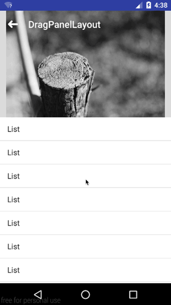

# DragPanelLayout
A layout providing expanding/collapsing behavior of it's child panel view.

Like [AndroidSlidingUpPanel](https://github.com/umano/AndroidSlidingUpPanel), this project aims to create a layout more functional. By now, I've implemented one more layout type and one more state and there are other functions in plan.

You can create panel just **follow the content** and forbid the panel move into a **forbidden area**. Which AndroidSlidingUpPanel can not do.

The final 1.0 version will be much more stable and other enhanced feature will release after that.

### Preview for now.

#### ToDo:

- 4 directions support.
- Trigger view.
- Multiple panel.
- Overscroll.